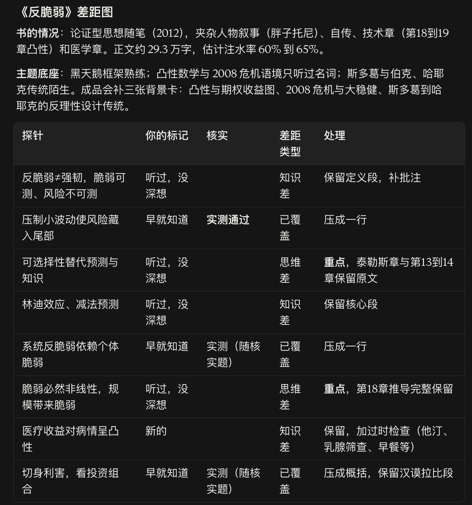
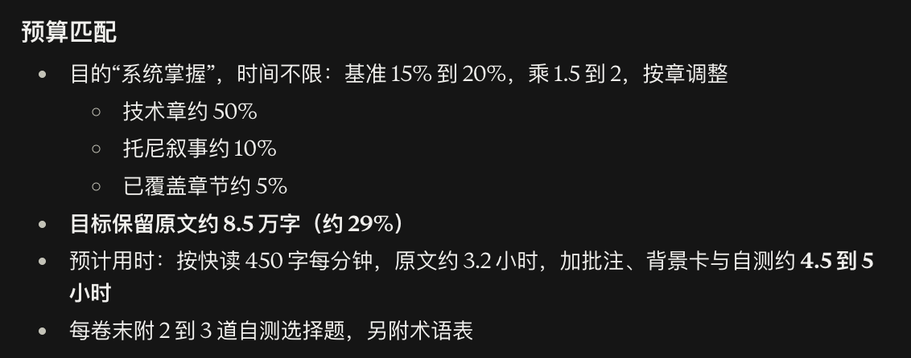
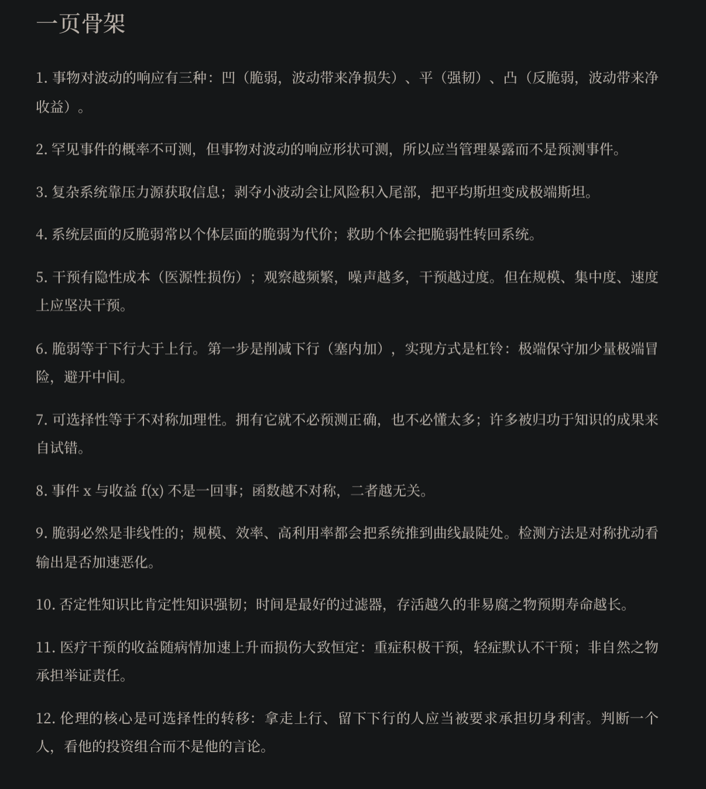
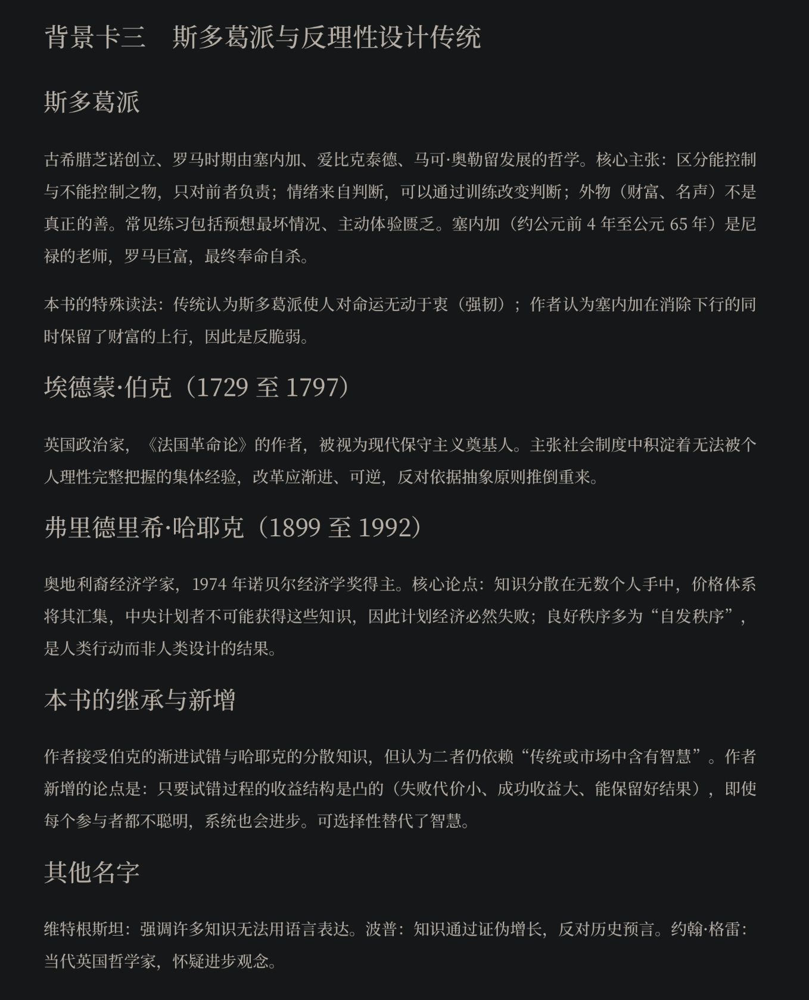
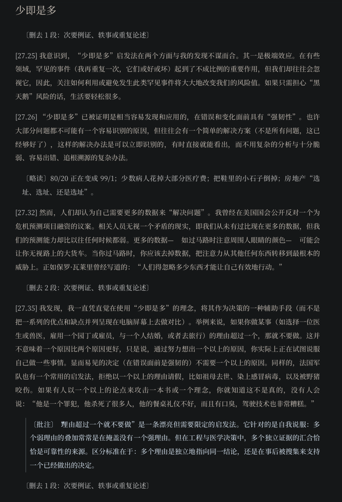

# Bespoke Reader

*Your book, cut to your measure.*

**English** | [简体中文](README.zh-CN.md)

Bespoke Reader tailors a whole book to one reader. It measures the gap between you and the book, keeps the original text you need, cuts what you already know, annotates the places you cannot yet cross alone, and hands you a personal EPUB.

An Agent Skill for Claude (apps and Claude Code), Codex, and other agents that support `SKILL.md`.

## Why it exists

A book and its reader are almost never aligned. Some chapters cover what you already know. Some passages sit above your current understanding. Others assume background you lack, and you often do not know you lack it. All three misalignments consume reading time, while the part you actually absorb stays small.

The usual alternatives are summaries, explainers, and guided readings. They save time, but someone else decides what is worth knowing, and the author's argument, the texture of the language, and the way the author thinks disappear along the way. What remains is a set of conclusions, not a book.

Bespoke Reader sits between the two. It does not read the book for you and does not rewrite it. It measures the gap between this reader and this book, then decides which parts of the original stay. Everything you read is still the author's own words.

## How it works

**1. Read the whole book and identify its type**
Fifteen types (argument, popular science, method, academic monograph, history, philosophy, fiction, poetry and drama, and more) each have their own unit of value and their own way of being trimmed. Philosophy, literary fiction, poetry, and detective fiction are never cut, only annotated.

**2. Calibrate with questions drawn from the book**
It never asks about your level. It turns the book's own claims and reasoning chains into multiple-choice questions, at most 20, adapting each batch to your previous answers.

- Topic layer: how familiar you are with the book's tradition and core concepts
- Claim probes: the book's specific claims; did you know it, hear of it without thinking it through, find it new, or disagree
- Self-assessment checks: spot-checks on what you marked as "knew it", to catch overestimation
- Thinking probes: reasoning depth, framework transfer, missing links; where your reasoning stops and how many steps further the author goes

**3. Show the gap map, and wait for your confirmation**

| Gap | Meaning | Treatment |
|---|---|---|
| Covered | You know it, and passed a check | Compressed to one line or cut |
| Knowledge gap | You lack a concept or background | Original kept, background card added |
| View gap | You hold a different view | Kept in full, with the author's premises and counterarguments |
| Thinking gap | You do not yet have the author's way of reasoning | Highest priority, marked as key |

Your reading goal and time budget then set the retained length and estimated reading time. When the budget cannot hold the essential passages, you decide; nothing essential is cut on your behalf.

**4. Trim, annotate, and build the EPUB**
Annotations point to mechanisms and what transfers beyond the book; they do not restate content. The EPUB opens directly in Apple Books, WeChat Read, and other reader apps.

## Example: *Antifragile*

Nassim Nicholas Taleb, *Antifragile: Things That Gain from Disorder* (2012). This run used the Chinese translation, so the screenshots are in Chinese; English translations of the generated parts follow each image.

| | |
|---|---|
| Book type | Argumentative essay, mixed with character narrative, autobiography, technical chapters, and medical chapters |
| Reading goal | Master it systematically |
| Time budget | Unlimited |
| Original text | ~293,000 Chinese characters, estimated padding 60% to 65% |
| Retained | ~85,000 characters (~29%) |
| Estimated reading time | 4.5 to 5 hours (including annotations, background cards, and self-tests) |

**1. Gap map**: generated after calibration; nothing is cut until the reader confirms it. A "knew it" answer is compressed only after passing a check question.



<details>
<summary>English translation</summary>

**The book**: argumentative essay (2012) mixed with character narrative (Fat Tony), autobiography, technical chapters (Ch. 18 to 19, convexity), and medical chapters. About 293,000 characters, estimated padding 60% to 65%.

**Topic foundation**: fluent in the Black Swan framework; has only heard the terms for convexity math and the 2008 crisis context; unfamiliar with the Stoics and the Burke and Hayek tradition. Three background cards will be added: convexity and option payoffs, the 2008 crisis and the Great Moderation, and the anti-rationalist design tradition from the Stoics to Hayek.

| Probe | Reader's answer | Check | Gap | Treatment |
|---|---|---|---|---|
| Antifragile is not robust; fragility is measurable, risk is not | Heard of it, never thought it through | | Knowledge | Keep definition passages, add notes |
| Suppressing small volatility hides risk in the tails | Knew it | **Verified** | Covered | Compress to one line |
| Optionality substitutes for prediction and knowledge | Heard of it, never thought it through | | Thinking | **Key**: keep the Thales chapter and Ch. 13 to 14 in full |
| Lindy effect, subtractive prediction | Heard of it, never thought it through | | Knowledge | Keep core passages |
| System antifragility depends on individual fragility | Knew it | Verified (via check) | Covered | Compress to one line |
| Fragility is necessarily nonlinear; size brings fragility | Heard of it, never thought it through | | Thinking | **Key**: keep the Ch. 18 derivation in full |
| Medical benefit is convex in the severity of illness | New | | Knowledge | Keep, add outdatedness check (statins, mammography, breakfast) |
| Skin in the game; judge people by their portfolio | Knew it | Verified (via check) | Covered | Summarize, keep the Hammurabi passage |

</details>

**2. Budget fit**: retention is computed from type, goal, and budget, with different rates for technical, narrative, and already covered chapters.



<details>
<summary>English translation</summary>

- Goal "master systematically", unlimited time: base 15% to 20%, ×1.5 to 2, adjusted per chapter
  - Technical chapters ~50%
  - Fat Tony narrative ~10%
  - Covered chapters ~5%
- **Target retained original text ~85,000 characters (~29%)**
- Estimated time: 3.2 hours of original text at 450 characters/min; **4.5 to 5 hours** with annotations, background cards, and self-tests
- 2 to 3 self-test questions at the end of each part, plus a glossary

</details>

**3. One-page skeleton**: placed in the front matter, so the structure of the whole book is in place before reading.



<details>
<summary>English translation</summary>

1. Things respond to volatility in three ways: concave (fragile, volatility brings net loss), flat (robust), convex (antifragile, volatility brings net gain).
2. The probability of rare events cannot be measured, but the shape of a thing's response to volatility can, so manage exposure instead of predicting events.
3. Complex systems gain information from stressors; removing small volatility pushes risk into the tails and turns Mediocristan into Extremistan.
4. Antifragility at the system level often comes at the cost of fragility at the individual level; bailing out individuals transfers fragility back to the system.
5. Intervention has hidden costs (iatrogenics); the more often one observes, the more noise, the more overintervention. But on size, concentration, and speed, intervene decisively.
6. Fragility means more downside than upside. The first step is cutting downside (Seneca), implemented as a barbell: extreme caution plus a small amount of extreme risk, avoiding the middle.
7. Optionality equals asymmetry plus rationality. With it, one need not predict correctly or know much; many achievements credited to knowledge come from trial and error.
8. The event x and the payoff f(x) are not the same thing; the more asymmetric the function, the less they are related.
9. Fragility is necessarily nonlinear; size, efficiency, and high leverage push systems to the steepest part of the curve. The test: apply symmetric perturbations and see whether the output deteriorates at an accelerating rate.
10. Negative knowledge is more robust than positive knowledge; time is the best filter, and the longer a nonperishable thing has survived, the longer its life expectancy.
11. The benefit of medical intervention rises with severity at an accelerating rate while harm stays roughly constant: intervene aggressively in severe cases, default to not intervening in mild ones; the unnatural bears the burden of proof.
12. The core of ethics is the transfer of optionality: those who take the upside and leave the downside to others should be required to have skin in the game. Judge a person by their portfolio, not their words.

</details>

**4. Background card**: every topic marked "unfamiliar" during calibration gets a card in the front matter, including what this book inherits from that tradition and what it adds.



<details>
<summary>English translation (excerpt)</summary>

**Background card 3: The Stoics and the anti-rationalist design tradition**

**The Stoics.** Founded by Zeno in Greece and developed in Rome by Seneca, Epictetus, and Marcus Aurelius. Distinguish what one can control from what one cannot and take responsibility only for the former; emotions come from judgments, which training can change; external goods such as wealth and fame are not true goods. *This book's particular reading*: tradition sees Stoicism as making one indifferent to fortune (robust); the author argues that Seneca removed the downside while keeping the upside of wealth, which makes him antifragile.

**Edmund Burke (1729 to 1797)** and **Friedrich Hayek (1899 to 1992)**: institutions hold collective experience no individual reason can fully grasp; knowledge is dispersed, and good order is mostly spontaneous.

**What this book inherits and adds.** The author accepts Burke's gradual trial and error and Hayek's dispersed knowledge, but notes that both still rely on "wisdom contained in tradition or markets". The author's addition: as long as the payoff of trial and error is convex (small cost of failure, large gain from success, good results retained), the system improves even if no participant is clever. Optionality replaces wisdom.

</details>

**5. The tailored text**: original paragraphs keep their locators, secondary examples are cut with a stated reason, repetition becomes a skim, and the annotation marks where the author's heuristic stops applying.



<details>
<summary>English translation of the generated parts</summary>

- `[Cut 1 ¶: secondary example, anecdote, or repeated argument]`
- `[Skim]` 80/20 is becoming 99/1; a few patients account for most medical spending; shake the pebble out of your shoe; real estate is "location, location, location".
- `[Note]` "If you have more than one reason to do something, don't do it" is an elegant heuristic that needs limits. It targets self-persuasion: stacking weak reasons often hides the absence of a strong one. In engineering and medical decisions, however, the convergence of several independent lines of evidence is precisely what makes a conclusion reliable. The distinction lies in whether the reasons point to the conclusion independently, or were gathered afterward to support a decision already made.

</details>

The screenshots show only brief excerpts of the book for illustration. The full EPUB contains the book's text and is not included in this repository.

## What you get

- **Front matter**: gap map, background cards, a one-page skeleton of the book, and type-specific cards (concept maps, timelines, method cards, character maps)
- **Body**: the original text in its original order, with markers
  - `[Skim]` summarized passage
  - `[Cut N ¶: reason]` where and why something was cut
  - `[Note]` annotation on mechanism
  - `[Predict]` a question to think about before reading on
  - `[Don't skip]` a passage that challenges your position and is most worth reading
- **Back matter**: where the author's ideas come from, present-day mapping, limits and counterarguments, and a full cut log

Chinese readers get the same structure with Chinese markers (`〔略读〕` `〔批注〕` `〔别跳〕` …). Questions, annotations, and markers always follow your language; the book's text stays in its own language.

## Design principles

- Measures only the gap between you and this book; never grades your overall level.
- Nothing is cut before you confirm the gap map.
- An unverified "knew it" is summarized, never cut.
- Every book keeps one to three passages that oppose your position, so the tool never simply confirms what you already believe.
- AI extrapolation is always kept separate from the author's views.
- No spoilers in pre-reading mode.

## Installation

The `bespoke-reader/` folder is the skill itself (`SKILL.md` plus `scripts/`). The host must be able to run Python to parse and package EPUB files.

```bash
git clone https://github.com/<username>/bespoke-reader.git
```

**Claude apps (web or desktop)**
Zip the `bespoke-reader/` folder and upload it on the Skills page in Settings. Code execution must be enabled.

**Claude Code**
```bash
cp -r bespoke-reader/bespoke-reader ~/.claude/skills/
```

**Codex**
```bash
cp -r bespoke-reader/bespoke-reader ~/.agents/skills/
```

## Usage

Give the agent a book file (EPUB preferred; PDF and TXT also work) and say any of:

- "Tailor this book to me"
- "Bespoke reading"
- "Cut this book to my level"

Then answer the questions about your goal, time budget, and calibration.

## Copyright

The output contains the book's text. It is for the personal use of a reader who owns the book. Do not share it publicly.

## License

MIT
