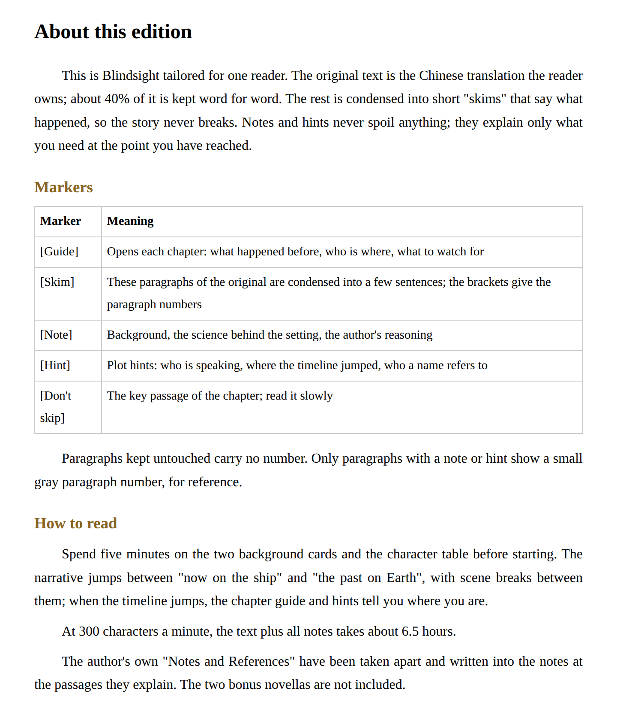
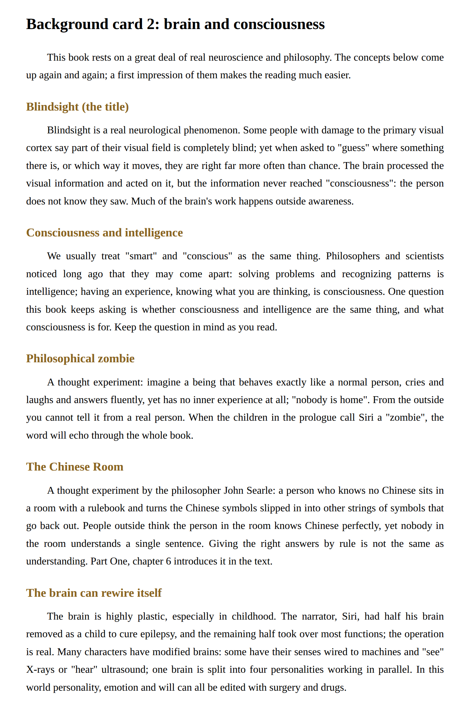
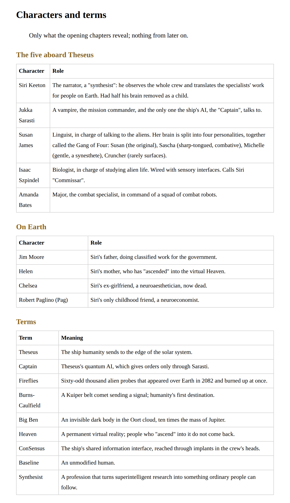
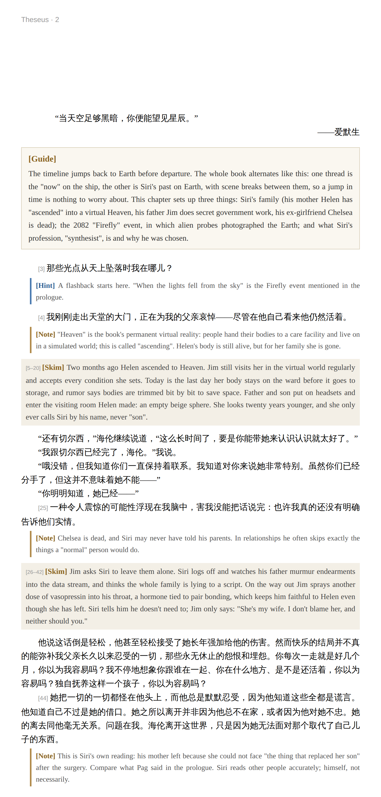
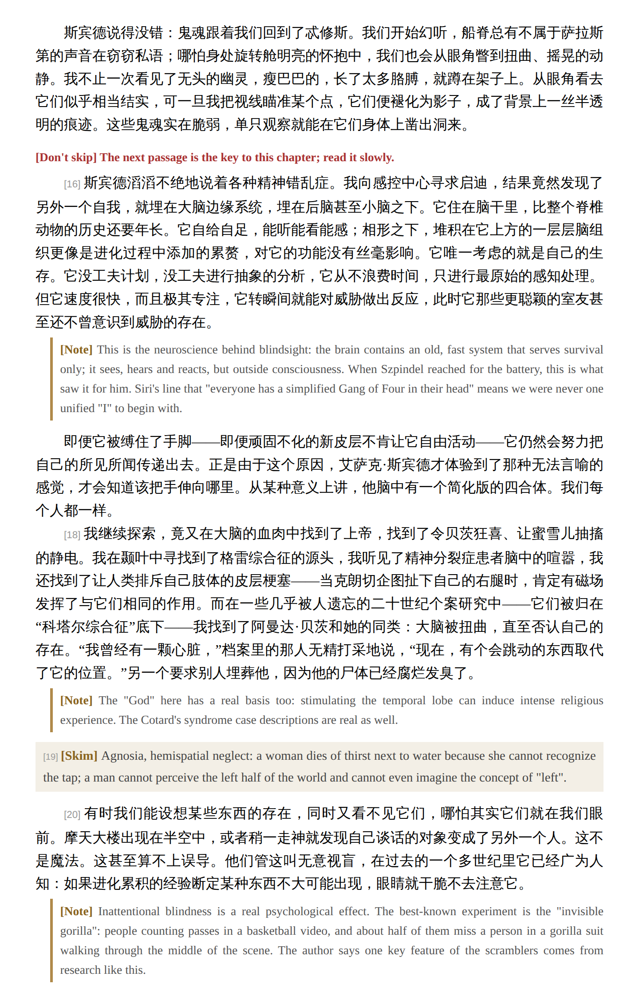

# Bespoke Reader 2.0

*Your book, cut to your measure.*

**English** | [简体中文](README.zh-CN.md)

Bespoke Reader tailors a whole book to one reader. It keeps the original text you need, cuts what you already know, annotates and supplies background where you cannot yet cross alone, gives hard novels chapter guides, character tables and plot hints, and hands you a personal EPUB that keeps the book's own cover and styling.

It has one aim: the smoothest, most comfortable reading of this book you can have. Your time goes to the book itself, not to re-reading what you already know, looking things up halfway through a page, or finding your way back in.

An Agent Skill for Claude (apps and Claude Code), Codex, and other agents that support `SKILL.md`.

## You may know these problems

- **Not enough time.** Too many books worth reading, each running to hundreds of pages, and no way to know which parts to read.
- **Padded books.** In a book you care about, perhaps a third carries the value; the rest is repeated examples, build-up and throat-clearing. You cannot tell which third in advance.
- **Background is a chore, and skipping it leaves you lost.** Stopping to look up concepts, allusions and history breaks the flow; not stopping means reading in a fog and keeping little.
- **Complex novels lose you.** In Dostoevsky one person goes by five or six names; in Latin American family sagas several generations share the same names; timelines jump. Halfway through you no longer know who is who, how they are related, or where the story stands.
- **Summaries and explainers are someone else's reading.** They save time, but someone else chose what matters. The author's argument, language and way of thinking disappear, and the understanding you end up with is not your own.

Bespoke Reader sits between reading the whole book cold and reading about it. It does not read the book for you and does not rewrite it. It measures the gap between you and this book, then decides which parts of the original stay. Everything you read is still the author's own words, minus the time you should not have to spend, plus exactly the help you need.

## What is new in 2.0

- **Reader aids for fiction.** Every chapter opens with a `[Guide]` (previously, who is where, what to watch for); `[Hint]` lines mark jumps in time, changes of narrator, and people appearing under a new name; the front matter has a character and term table limited to what you have reached. For dense classics, every name form of every character is listed.
- **Trimmed pre-reading mode.** Novels can be cut to a time budget too. Every removed stretch of plot becomes a `[Skim]` that says what happened, so the story never breaks; passages of ideas, turning points and passages where form carries meaning stay whole.
- **Cleaner pages.** Untouched paragraphs carry no locator; only paragraphs with a note, hint or flag, and the skim lines, show a small number.
- **The book stays the book.** Original cover, stylesheets, illustrations and translator's notes are kept; nothing is appended to the title.
- **Budget planned up front.** Characters are allocated to each chapter before any spec is written and checked as the work goes; reading time counts the whole load (original, summaries, notes, front and back matter).
- **Author's notes folded in.** Endnotes and references are turned into annotations at the passages they explain; in pre-reading mode only what the text has already revealed is used.
- **Resumable and revisable.** A state file records every decision, and the route specs contain no book text, so they are safe to back up. A new session, or a reader returning with complaints about an earlier version, picks up where things stopped.
- **Three new scripts.** `extract_epub.py` keeps paragraph formatting and footnotes, `check_spec.py` checks route specs and computes reading time, `build_epub.py` builds and validates the EPUB.

## How it works

**1. Read the whole book and identify its type**
Types (argument, popular science, method, academic monograph, history, philosophy, science fiction, literary fiction, poetry and drama, and more) each have their own unit of value and their own way of being trimmed. Philosophy, literary fiction, poetry, and detective fiction are not cut by default, only annotated and given reader aids.

**2. Calibrate with questions drawn from the book**
It never asks about your level. It turns the book's own claims, reasoning chains and background fields into multiple-choice questions, at most 20, adapting each batch to your previous answers.

- Topic layer: how familiar you are with the book's tradition, core concepts and background fields
- Claim probes: the book's specific claims; did you know it, hear of it without thinking it through, find it new, or disagree
- Self-assessment checks: spot-checks on what you marked as "knew it", to catch overestimation
- Thinking probes: reasoning depth, framework transfer, missing links; where your reasoning stops and how many steps further the author goes
- For fiction: have you read it, what makes it hard for you (names, timeline, background, ideas), how much hints may reveal

**3. Show the gap map and the budget, and wait for your confirmation**

| Gap | Meaning | Treatment |
|---|---|---|
| Covered | You know it, and passed a check | Compressed to one line or cut |
| Knowledge gap | You lack a concept or background | Original kept, background card and notes added |
| View gap | You hold a different view | Kept in full, with the author's premises and counterarguments |
| Thinking gap | You do not yet have the author's way of reasoning | Highest priority, marked as key |

Your reading goal and time budget then set the retained length, allocated chapter by chapter. When the budget cannot hold the essential passages, you decide; nothing essential is cut on your behalf.

**4. Trim, annotate, and build the EPUB**
Annotations point to mechanisms, background and what transfers beyond the book; they do not restate content. After the first part you get a preview EPUB, so format questions are settled in your own reader app before the rest is done. The EPUB opens directly in Apple Books, WeChat Read, and other reader apps.

## Example 1: *Blindsight* (new in 2.0)

Peter Watts, *Blindsight* (2006), Chinese translation by Hu Shu (Imaginist, 2021). Hard science fiction built on philosophy of mind and neuroscience, with a large cast, dense terminology, and a narrative that jumps between two timelines.

| | |
|---|---|
| Type | Idea-driven hard SF, pre-reading mode (trimmed) |
| Reader | "Only heard the terms" for both philosophy of mind and neuroscience; found the previous version too long, too little help, and missing the original cover |
| Request | About 40% of the text, hints only about what has happened so far, chapter guides plus in-text hints |
| Original text | ~199,000 Chinese characters (two bonus novellas excluded) |
| Retained | ~83,000 characters (42%) |
| Reader aids | 24 chapter guides, 180 skims, 250+ annotations, 17 Don't skip flags, 2 background cards, a character and term table, an after-reading page |
| Estimated reading time | About 6.5 hours at 300 characters per minute, all annotations included |

The screenshots below come from this run. The reader read the Chinese translation, so the book's own paragraphs are in Chinese; everything the skill generated (guides, skims, notes, hints, cards) is shown here in English translation, rendered with the same build script and `--lang en`. Nothing else has been added or polished.

**1. About this edition**: marker legend, suggested reading order, estimated time. Untouched paragraphs carry no number.



**2. Background card**: one for each field the reader marked "only heard the term". The title itself names a real neurological phenomenon.



**3. Characters and terms**: only what the opening chapters reveal.



**4. Chapter guide, hint, skims and notes**: when the story jumps back to Earth, the guide says where we are; removed plot becomes a skim, so the story never breaks.



**5. Don't skip and a core passage**: the passage carrying the book's central idea stays whole, and the notes add the real neuroscience behind it.



What a route spec looks like (one per chapter: paragraph ranges, skims and notes, no book text): [examples/blindsight/route-spec-sample.en.txt](examples/blindsight/route-spec-sample.en.txt) (English translation; the original is [route-spec-sample.txt](examples/blindsight/route-spec-sample.txt)). It contains plot from Part Two.

## Example 2: *Antifragile*

Nassim Nicholas Taleb, *Antifragile: Things That Gain from Disorder* (2012).

Everything in the quoted blocks below is real output from one run of an earlier version of the skill, not a mockup. The run used the Chinese edition, so the generated text is shown here in English translation; nothing else has been added or polished.

| | |
|---|---|
| Book type | Argumentative essay, mixed with character narrative, autobiography, technical chapters, and medical chapters |
| Reading goal | Master it systematically |
| Time budget | Unlimited |
| Original text | ~293,000 Chinese characters, estimated padding 60% to 65% |
| Retained | ~85,000 characters (~29%) |
| Estimated reading time | 4.5 to 5 hours (including annotations, background cards, and self-tests) |

### 1. Gap map

Generated after calibration; nothing is cut until the reader confirms it. A "knew it" answer is compressed only after passing a check question.

> **The book**: argumentative essay (2012) mixed with character narrative (Fat Tony), autobiography, technical chapters (Ch. 18 to 19, convexity), and medical chapters. About 293,000 characters, estimated padding 60% to 65%.
>
> **Topic foundation**: fluent in the Black Swan framework; has only heard the terms for convexity math and the 2008 crisis context; unfamiliar with the Stoics and the Burke and Hayek tradition. Three background cards will be added: convexity and option payoffs, the 2008 crisis and the Great Moderation, and the anti-rationalist design tradition from the Stoics to Hayek.
>
> | Probe | Reader's answer | Check | Gap | Treatment |
> |---|---|---|---|---|
> | Antifragile is not robust; fragility is measurable, risk is not | Heard of it, never thought it through | | Knowledge | Keep definition passages, add notes |
> | Suppressing small volatility hides risk in the tails | Knew it | **Verified** | Covered | Compress to one line |
> | Optionality substitutes for prediction and knowledge | Heard of it, never thought it through | | Thinking | **Key**: keep the Thales chapter and Ch. 13 to 14 in full |
> | Lindy effect, subtractive prediction | Heard of it, never thought it through | | Knowledge | Keep core passages |
> | System antifragility depends on individual fragility | Knew it | Verified (via check) | Covered | Compress to one line |
> | Fragility is necessarily nonlinear; size brings fragility | Heard of it, never thought it through | | Thinking | **Key**: keep the Ch. 18 derivation in full |
> | Medical benefit is convex in the severity of illness | New | | Knowledge | Keep, add outdatedness check (statins, mammography, breakfast) |
> | Skin in the game; judge people by their portfolio | Knew it | Verified (via check) | Covered | Summarize, keep the Hammurabi passage |

### 2. Budget fit

> - Goal "master systematically", unlimited time: base 15% to 20%, ×1.5 to 2, adjusted per chapter
>   - Technical chapters ~50%
>   - Fat Tony narrative ~10%
>   - Covered chapters ~5%
> - **Target retained original text ~85,000 characters (~29%)**
> - Estimated time: 3.2 hours of original text at 450 characters/min; **4.5 to 5 hours** with annotations, background cards, and self-tests
> - 2 to 3 self-test questions at the end of each part, plus a glossary

### 3. One-page skeleton (excerpt)

> 1. Things respond to volatility in three ways: concave (fragile, volatility brings net loss), flat (robust), convex (antifragile, volatility brings net gain).
> 2. The probability of rare events cannot be measured, but the shape of a thing's response to volatility can, so manage exposure instead of predicting events.
> 3. Complex systems gain information from stressors; removing small volatility pushes risk into the tails and turns Mediocristan into Extremistan.
> 4. Antifragility at the system level often comes at the cost of fragility at the individual level; bailing out individuals transfers fragility back to the system.
> 5. Intervention has hidden costs (iatrogenics); the more often one observes, the more noise, the more overintervention. But on size, concentration, and speed, intervene decisively.
> 6. Fragility means more downside than upside. The first step is cutting downside (Seneca), implemented as a barbell: extreme caution plus a small amount of extreme risk, avoiding the middle.

### 4. Background card (excerpt)

> **Background card 3: The Stoics and the anti-rationalist design tradition**
>
> **The Stoics.** Founded by Zeno in Greece and developed in Rome by Seneca, Epictetus, and Marcus Aurelius. Distinguish what one can control from what one cannot and take responsibility only for the former; emotions come from judgments, which training can change; external goods such as wealth and fame are not true goods. *This book's particular reading*: tradition sees Stoicism as making one indifferent to fortune (robust); the author argues that Seneca removed the downside while keeping the upside of wealth, which makes him antifragile.
>
> **What this book inherits and adds.** The author accepts Burke's gradual trial and error and Hayek's dispersed knowledge, but notes that both still rely on "wisdom contained in tradition or markets". The author's addition: as long as the payoff of trial and error is convex (small cost of failure, large gain from success, good results retained), the system improves even if no participant is clever. Optionality replaces wisdom.

### 5. The tailored text

Secondary examples are cut with a stated reason, repetition becomes a skim, and the annotation marks where the author's heuristic stops applying. Only the generated markers from one page are shown.

> `[Cut 1 ¶: secondary example, anecdote, or repeated argument]`
>
> `[Skim]` 80/20 is becoming 99/1; a few patients account for most medical spending; shake the pebble out of your shoe; real estate is "location, location, location".
>
> `[Note]` "If you have more than one reason to do something, don't do it" is an elegant heuristic that needs limits. It targets self-persuasion: stacking weak reasons often hides the absence of a strong one. In engineering and medical decisions, however, the convergence of several independent lines of evidence is precisely what makes a conclusion reliable. The distinction lies in whether the reasons point to the conclusion independently, or were gathered afterward to support a decision already made.

The full EPUBs contain the books' text and are not included in this repository.

## What you get

- **Front matter**: about this edition (marker legend, estimated time), gap map, background cards, a one-page skeleton, and type-specific cards (concept maps, timelines, method cards, character and term tables, relationship maps)
- **Body**: the original text in its original order, with markers
  - `[Guide]` chapter opening: previously, who is where, what to watch for
  - `[Skim]` summarized passage; in fiction, what happened
  - `[Cut N ¶: reason]` where and why something was cut
  - `[Note]` mechanism, background, what transfers
  - `[Hint]` who is speaking, where the timeline jumped, who a name refers to
  - `[Predict]` a question to think about before reading on
  - `[Don't skip]` the key passage, or one that challenges your position
- **Back matter**: for nonfiction, where the author's ideas come from, present-day mapping, limits and counterarguments, and a cut log; for fiction, an after-reading discussion marked as containing the ending

Chinese readers get the same structure with Chinese markers (`〔导读〕` `〔略读〕` `〔批注〕` `〔提示〕` `〔别跳〕` …). Questions, annotations, and markers always follow your language; the book's text stays in its own language.

## Design principles

- Measures only the gap between you and this book; never grades your overall level.
- Nothing is cut before you confirm the gap map.
- An unverified "knew it" is summarized, never cut.
- Every book keeps one to three passages that oppose your position, so the tool never simply confirms what you already believe.
- AI extrapolation is always kept separate from the author's views.
- In pre-reading mode, guides, hints and notes never spoil, not even by implication.
- The book stays the book: its cover, its title, its translation.

## Installation

The `bespoke-reader/` folder is the skill itself (`SKILL.md` plus `scripts/`). The host must be able to run Python 3 to parse and package EPUB files; no extra packages are needed.

```bash
git clone https://github.com/AspldeZ/bespoke-reader.git
```

**Claude apps (web or desktop)**
Zip the `bespoke-reader/` folder and upload it on the Skills page in Settings. Code execution must be enabled.

**Claude Code**
```bash
cp -r bespoke-reader/bespoke-reader ~/.claude/skills/
```

**Codex**
```bash
cp -r bespoke-reader/bespoke-reader ~/.agents/skills/
```

## Usage

Give the agent a book file (EPUB preferred; PDF and TXT also work) and say any of:

- "Tailor this book to me"
- "Bespoke reading"
- "Cut this book to my level"

Then answer the questions about your goal, time budget, and calibration. You get a preview after the first part; to adjust, just say "still too long" or "more hints".

## Scripts

| Script | What it does |
|---|---|
| `scripts/extract_epub.py` | Numbers every paragraph, keeps its formatting, separates footnotes, keeps the cover and styles for the build |
| `scripts/check_spec.py` | Checks route specs (coverage, overlaps, note placement) and computes reading time against the budget, flagging overshoot as you go |
| `scripts/build_epub.py` | Builds the EPUB from the route specs with the original cover, styles, illustrations and footnotes, and validates every document |

## Copyright

The output contains the book's text. It is for the personal use of a reader who owns the book. Do not share it publicly. The screenshots in this repository show only short excerpts to illustrate the output.

## License

MIT
