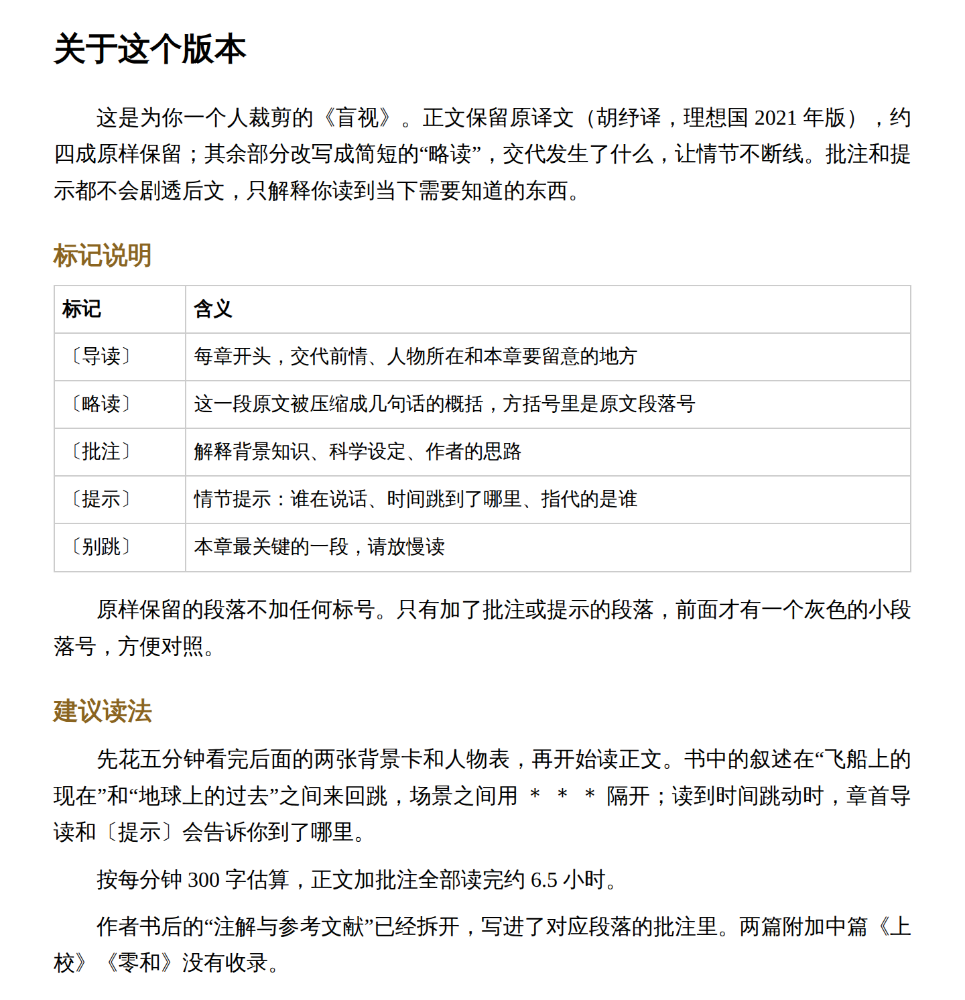
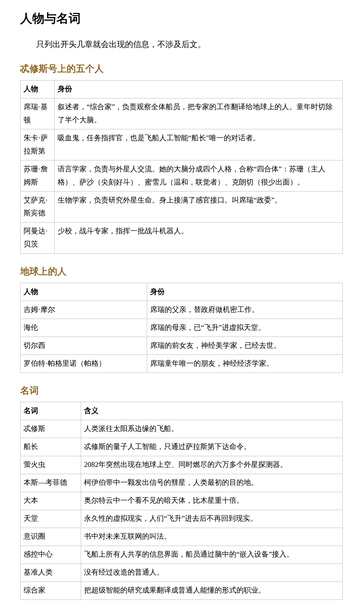
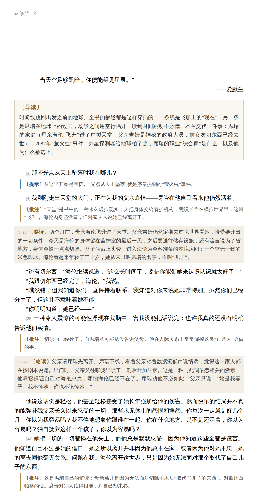
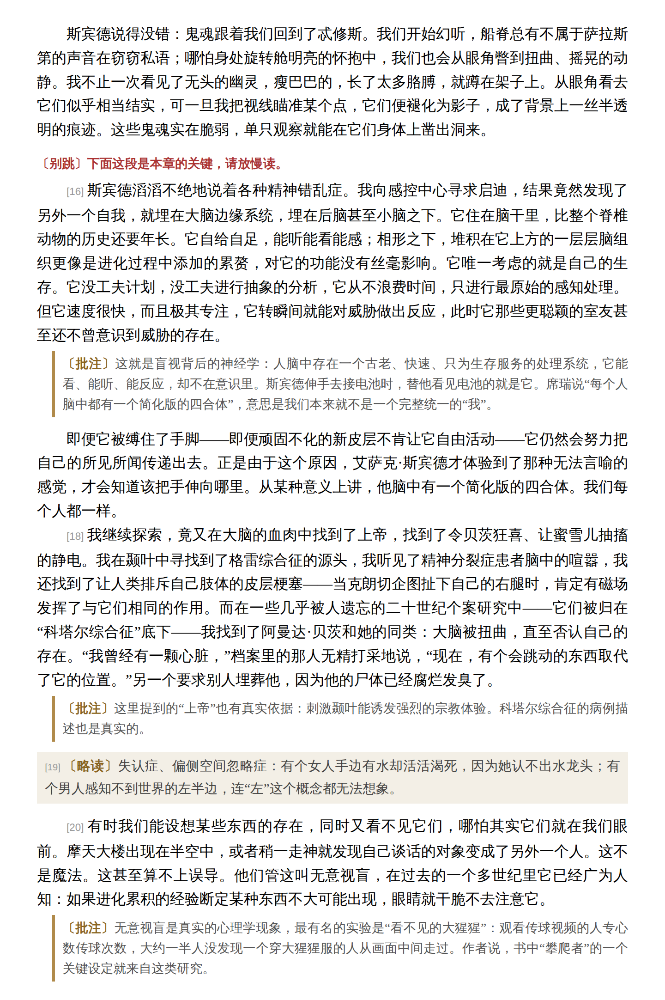
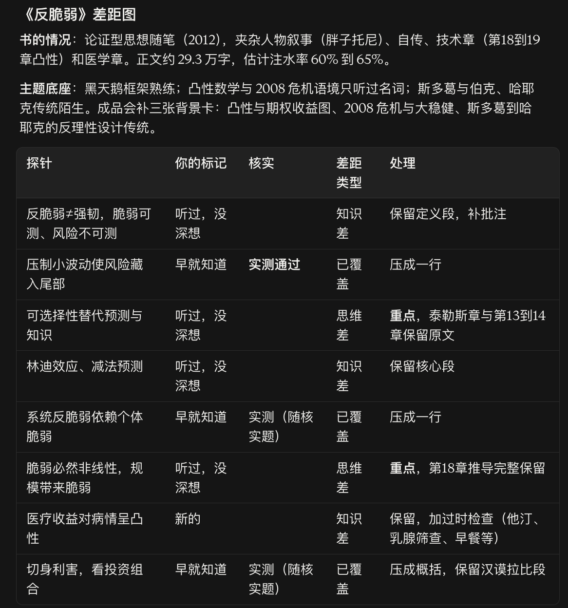
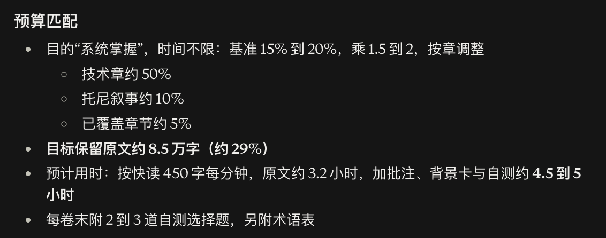
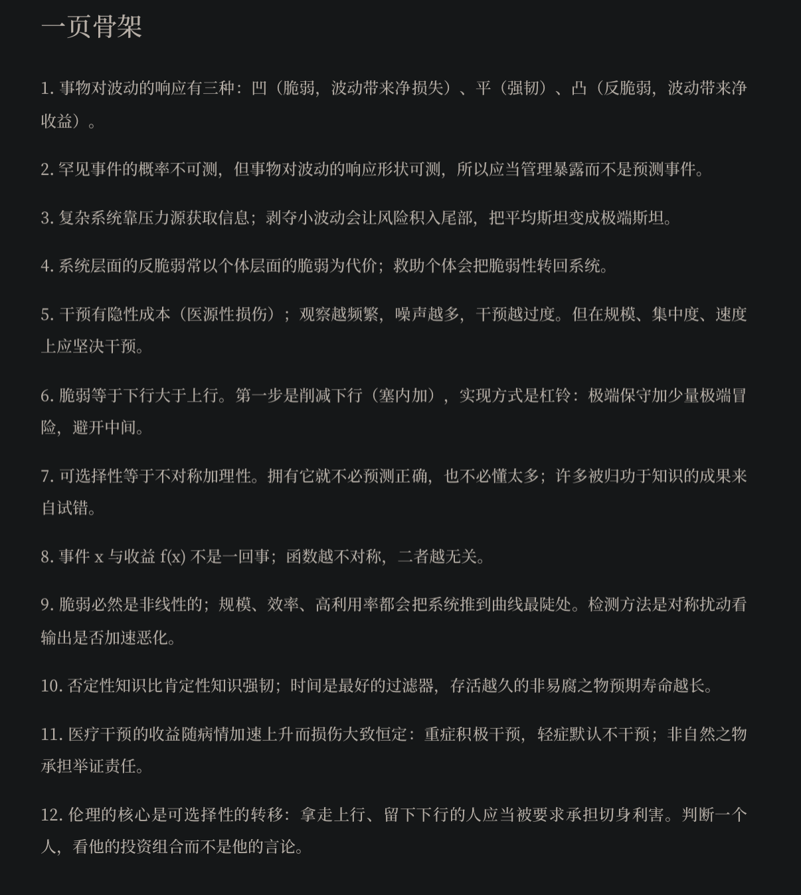
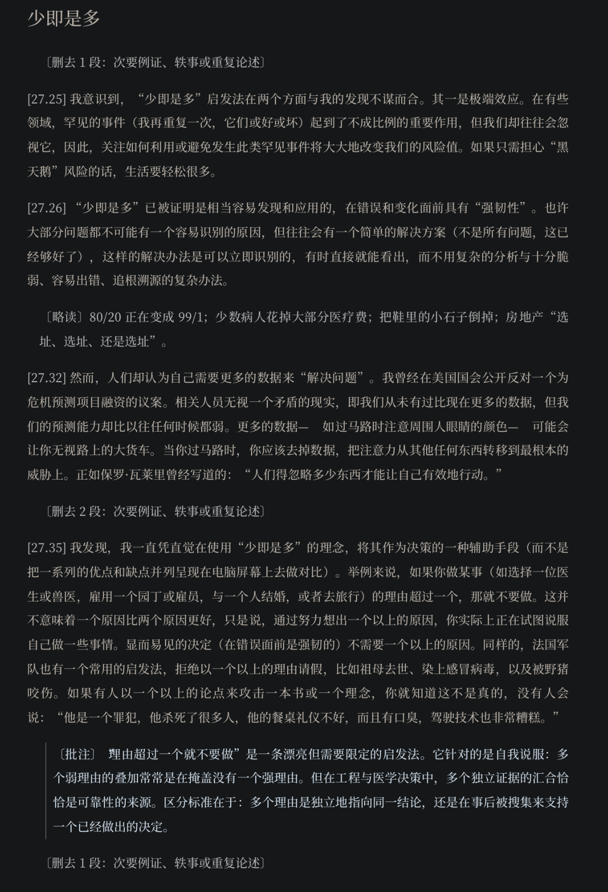

# 量体裁书 Bespoke Reader 2.0

[English](README.md) | **简体中文**

把一整本书按你一个人的尺寸裁好：该读的原文留下，已经懂的删去，难以独自跨过的地方加上批注与背景，复杂小说配好导读、人物表和情节提示，最后生成一本保留原书封面与排版的个人版 EPUB。

它的目标只有一个：让这一本书读起来最顺、最舒服。时间花在书本身上，而不是花在反复对齐、进入状态上。

适用于 Claude（应用与 Claude Code）、Codex 及其他支持 `SKILL.md` 的智能体。

## 你可能遇到过这些情况

- **时间不够。** 想读的书太多，一本动辄三四十万字，读不完，也不知道该从哪里挑着读。
- **感兴趣的书注水严重。** 真正有价值的也许只有三成，剩下是重复的例子、铺垫和客套，可你事先并不知道哪三成是重点。
- **补背景太麻烦，不补又云里雾里。** 读到一半要停下来查概念、查典故、查历史，节奏全断；不查就囫囵吞枣，读完吸收得很少。
- **复杂小说理不清。** 陀思妥耶夫斯基笔下一个人有五六种叫法，拉美家族小说里几代人重名，时间线来回跳，读到一半已经分不清谁是谁、谁和谁什么关系、故事走到了哪里。
- **看解说又不是自己的东西。** 拆书、解读、书评节省了时间，可你读到的是别人挑选的结论，作者的论证、语言和思考方式都没了，也不是你自己读出来的理解。

量体裁书处在“硬读原书”和“看别人解说”之间。它不替你读书，也不改写原作：先测出你和这本书之间的差距，再决定原文的去留。你读到的仍是作者本人的文字，只是少了不该浪费的时间，多了恰好需要的帮助。

## 2.0 更新了什么

- **小说有了完整的读者辅助。** 每章开头有〔导读〕，交代前情、谁在哪、本章要留意什么；叙述跳跃、人物换了称呼的地方有随文〔提示〕；书前有人物与名词表，只列到你读到的位置，不剧透。复杂经典小说会列出人名的所有叫法。
- **删减版预读模式。** 小说也能按时间预算删减。删掉的情节一律换成交代“发生了什么”的〔略读〕，故事不会断；思想段落、转折点和承载形式的段落整段保留。
- **读起来更干净。** 原样保留的段落不再加编号，只有加了批注、提示或被略读替换的地方才显示小标号。
- **保留原书的样子。** 沿用原书封面、样式、插图和译注，书名不加任何后缀。
- **预算事先分配。** 动笔前先把字数分到每一章，边写边查；阅读时间按“原文 + 略读 + 批注 + 前后置页”的总量计算，不再低估。
- **作者注解拆进批注。** 书后注解与参考文献被写进对应段落；预读模式下只用已揭示的部分，不借注解剧透。
- **可以接力，可以修订。** 进度文件记录全部决定；删减规格不含原书文字，可以放心备份。换一个会话，或者拿着旧版提意见，都能从断点继续。
- **三个新脚本。** `extract_epub.py` 保留段落原始格式与脚注，`check_spec.py` 检查删减规格并计算阅读时间，`build_epub.py` 生成 EPUB 并校验。

## 工作方式

**1. 通读全书，判断类型**
识别书的类型（论证型非虚构、科普、方法类、学术专著、历史、哲学、科幻、严肃文学、诗歌戏剧等），不同类型的价值单位与裁剪方式不同。哲学、严肃文学、诗歌与推理小说默认不删，只加注释与辅助。

**2. 用书本身出题校准**
不问你的水平，而是从书中提取论断、推理链和背景领域，出选择题测量差距。整个校准不超过 20 题，并根据上一批回答自适应调整。

- 主题层：对全书思想脉络、核心概念和背景领域的熟悉程度
- 论断探针：书中特有的论断，你是早已知道、听过未深想、全新，还是不同意
- 自评核实：抽查标为“早就知道”的项，防止高估
- 思维探针：推理深度、框架迁移、缺环补全，测出作者多走了哪几步
- 小说另问：读过没有、难在哪里（人名、时间线、背景、思想）、提示可以透露到什么程度

**3. 生成差距图与预算，确认后再动手**

| 差距 | 含义 | 处理 |
|---|---|---|
| 已覆盖 | 你已知且通过核实 | 压成一行或删去 |
| 知识差 | 缺少书中的概念或背景 | 保留原文，补背景卡与批注 |
| 观念差 | 你持不同看法 | 完整保留，附作者前提与反驳 |
| 思维差 | 你尚不具备作者的推理方式 | 最高优先级，重点标出 |

再结合阅读目的与时间预算，把保留字数分配到每一章。预算容不下关键段落时，由你决定，而不是替你删掉。

**4. 裁剪、批注，输出 EPUB**
批注只指出机制、背景与可迁移之处，不复述内容。读完第一部分就先发一版样书，格式合不合意，在你自己的阅读器里一看便知。成品可直接在微信读书、Apple Books 等阅读器中打开。

## 示例一：《盲视》（2.0 新增）

彼得·沃茨，《盲视》（2006），胡纾译，理想国 2021 年版。一本以意识哲学和神经科学为骨架的硬科幻，人物多、术语密、叙事在两条时间线间跳动。

| | |
|---|---|
| 书的类型 | 思想型硬科幻，预读模式（删减版） |
| 读者情况 | 意识哲学、神经科学都“只听过名词”；上一版嫌太长、辅助不够、原封面丢失 |
| 要求 | 约四成篇幅，只讲当前、不剧透，章首导读加随文提示 |
| 原书正文 | 约 19.9 万字（不含两篇附加中篇） |
| 保留原文 | 约 8.3 万字（42%） |
| 辅助内容 | 24 篇章首导读、180 处略读、250 余条批注、17 处〔别跳〕、2 张背景卡、1 张人物名词表、1 页读后讨论 |
| 预计用时 | 约 6.5 小时（按每分钟 300 字，含全部批注） |

以下截图均为这次运行的真实成品，未经修饰。

**1. 关于这个版本**：标记说明、读法建议和预计用时。原样保留的段落不加编号。



**2. 背景卡**：校准中“只听过名词”的领域各配一张，书名“盲视”本身就是一个真实的神经学现象。


**3. 人物与名词表**：只写开头几章会出现的信息，不涉及后文。



**4. 章首导读、提示、略读与批注**：时间线跳回地球时，导读先交代“到了哪里”；删去的情节换成略读，故事不断线。



**5. 〔别跳〕与核心段落**：全书主题最集中的段落整段保留，批注补上真实的神经科学依据。



删减规格长这样（一章一份，只有段落编号、略读和批注，不含原书文字）：[examples/blindsight/route-spec-sample.txt](examples/blindsight/route-spec-sample.txt)，含第二部情节。

## 示例二：《反脆弱》

纳西姆·尼古拉斯·塔勒布，《反脆弱：从不确定性中获益》（2012），中译本。

| | |
|---|---|
| 书的类型 | 论证型思想随笔，夹杂人物叙事、自传、技术章与医学章 |
| 阅读目的 | 系统掌握 |
| 时间预算 | 不限 |
| 原书正文 | 约 29.3 万字，估计注水率 60% 到 65% |
| 保留原文 | 约 8.5 万字（约 29%） |
| 预计用时 | 4.5 到 5 小时（含批注、背景卡与自测） |

**1. 差距图**：校准结束后生成，确认后才开始裁剪。标为“早就知道”的项经过核实题检验才会被压缩。



**2. 预算匹配**：按类型、目的与时间预算计算保留率，技术章、叙事章与已覆盖章节分别取值。



**3. 一页骨架**：放在成品前置章，读正文之前先建立全书结构。



**4. 背景卡**：校准中标为“陌生”的主题，在前置章补一张背景卡，并说明本书在这一传统中的继承与新增。


**5. 成品正文**：次要例证删去并注明原因，重复内容改为略读，批注只指出论断的适用边界。（此例由旧版本生成，原文段落仍逐段带编号；2.0 起只在处理过的段落显示。）



截图仅展示少量原文用于说明效果，完整 EPUB 含原书文字，不放入本仓库。

## 成品包含什么

- **前置章**：关于这个版本（标记说明、预计用时）、差距图、背景卡、全书骨架，以及按类型附加的工具卡（概念依赖图、时间线、方法卡、人物与名词表、人物关系图等）
- **正文**：按原书顺序排列的原文，带以下标记
  - `〔导读〕` 章首导读：前情、人物所在、本章看点
  - `〔略读〕` 概括处理的段落，小说里交代“发生了什么”
  - `〔删去 N 段：原因〕` 删减位置与理由
  - `〔批注〕` 机制、背景与可迁移之处
  - `〔提示〕` 情节提示：谁在说话、时间跳到哪里、指代的是谁
  - `〔先想〕` 读前预测题
  - `〔别跳〕` 最关键、或与你立场相左、最值得读的段落
- **后置章**：非虚构有作者层分析、现实映射、局限与反驳、删减日志；小说有标明“读完再看”的读后讨论

提问、批注与标记始终使用你的语言，原书文字保持原语言。

## 设计原则

- 只测量你与这本书的差距，不评价你的整体水平。
- 未经你确认差距图，不开始删减。
- 未经核实的“早就知道”只做概括，不直接删去。
- 每本书强制保留一到三处与你立场相左的段落，避免工具只确认已有的观念。
- AI 的推演与作者观点严格区分。
- 预读模式下，导读、提示和批注都不剧透，也不用暗示剧透。
- 书还是原来那本书：原封面、原书名、原译文。

## 安装

仓库中的 `bespoke-reader/` 文件夹即为技能本体（`SKILL.md` 与 `scripts/`）。运行环境需要能执行 Python 3，用于解析与打包 EPUB，无需额外依赖。

```bash
git clone https://github.com/AspldeZ/bespoke-reader.git
```

**Claude 应用（网页或桌面端）**
将 `bespoke-reader/` 文件夹压缩为 zip，在设置的技能（Skills）页面上传，并开启代码执行。

**Claude Code**
```bash
cp -r bespoke-reader/bespoke-reader ~/.claude/skills/
```

**Codex**
```bash
cp -r bespoke-reader/bespoke-reader ~/.agents/skills/
```

## 使用

提供一本书的文件（推荐 EPUB，也支持 PDF 与 TXT），然后输入以下任一触发词：

- 量体裁书
- 差距阅读
- 帮我拆这本书
- 按我的水平处理这本书

随后按提示回答阅读目的、时间预算与校准选择题即可。读完第一部分会先收到一版样书，满意再做完全书；想调整，直接说“太长了”“提示再多些”即可修订。

## 脚本

| 脚本 | 作用 |
|---|---|
| `scripts/extract_epub.py` | 拆书：按段编号，保留原始格式，脚注单独提取，原书封面与样式留作生成时使用 |
| `scripts/check_spec.py` | 检查删减规格（覆盖、重叠、批注位置），按预算计算阅读时间，边写边提醒超标 |
| `scripts/build_epub.py` | 由删减规格生成 EPUB，带原封面、原样式、插图与译注，并校验每个文件 |

## 版权说明

成品包含原书文字，仅供持有该书的读者个人阅读使用，请勿公开传播。本仓库的示例截图只展示少量原文用于说明效果。

## 许可证

MIT
